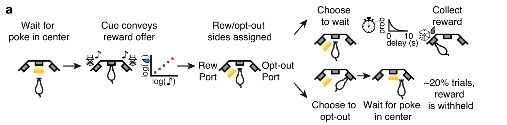
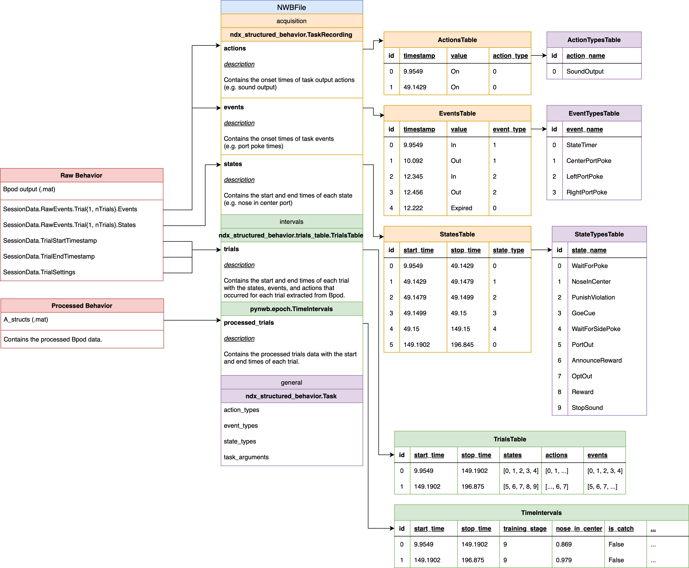

# Notes concerning the mah_2024 conversion

### Schematic of behavioral paradigm

From: [Distinct value computations support rapid sequential decisions](https://www.nature.com/articles/s41467-023-43250-x/figures/1)



LED illumination from the center port indicated that the animal could initiate a trial by poking its nose in that 
port - upon trial initiation the center LED turned off.
While in the center port, rats needed to maintain center  fixation for a duration drawn uniformly from [0.8, 1.2] seconds.
During the fixation period, a tone played from both speakers, the frequency of which indicated the volume of the offered
water reward for that trial [1, 2, 4, 8, 16kHz, indicating 5, 10, 20, 40, 80μL rewards]. 

Following the fixation period, one of the two side LEDs was illuminated, indicating that the reward might be delivered 
at that port; the side was randomly chosen on  each trial.This event (side LED ON) also initiated a variable and 
unpredictable delay period, which was randomly drawn from an exponential distribution with mean=2.5s. 
The reward port LED remained illuminated for the duration of the delay period, and rats were not required to maintain 
fixation during this period, although they tended to fixate in the reward port. When reward was available, the reward 
port LED turned off, and rats could collect the offered reward by nose poking in that port. The rat could also choose to
terminate the trial (opt-out) at any time by nose poking in the opposite, un-illuminated side port, after which a new 
trial would immediately begin. On a proportion of trials (15–25%), the delay period would only end if the rat opted out 
(catch trials). If rats did not opt-out within 100s on catch trials, the trial would terminate. 

The trials were self-paced: after receiving their reward or opting out, rats were free to initiate another trial 
immediately. However, if rats terminated center fixation prematurely, they were penalized with a white noise sound and
a time out penalty (typically 2s, although adjusted to individual animals). Following premature fixation breaks, the 
rats received the same offered reward, in order to disincentivize premature terminations for small volume offers. 
We introduced semi-observable, hidden states in the task by including uncued blocks of trials with varying reward 
statistics: high and low blocks , which offered the highest three or lowest three rewards, respectively, and were 
interspersed with mixed blocks, which offered all volumes. There was a hierarchical structure to the blocks, such that 
high and low blocks alternated after mixed blocks (e.g., mixed-high-mixed-low, or mixed-low-mixed-high). The first 
block of each session was a mixed block. Blocks transitioned after 40 successfully completed trials. Because rats 
prematurely broke fixation on a subset of trials, in practice, block durations were variable.

### Raw Bpod output

The raw Bpod output is a .mat file with the following fields:

- `SessionData` - a struct array containing the following fields:
    - `nTrials` - the number of trials
    - `TrialStartTimestamp` - the time the trial started [1 x nTrials]
    - `TrialEndTimestamp` - the time the trial ended [1 x nTrials]
    - `TrialSettings` - struct array containing the task arguments for each trial
    - `RawEvents` - a struct containing the following fields:
        - `Trial` - a struct array with one element per event [1 x nTrials]:
          - `States` - a struct containing the following fields:
            - `WaitForPoke` - [relative_start_time, relative_end_time]
            - `NoseInCenter` - [relative_start_time, relative_end_time]
            - `GoCue` - [relative_start_time, relative_end_time]
            - `WaitForSidePoke` - [relative_start_time, relative_end_time]
            - `PunishViolation` - [relative_start_time, relative_end_time]
            - `AnnounceReward` - [relative_start_time, relative_end_time]
            - `OptOut` - [relative_start_time, relative_end_time]
            - `Reward` - [relative_start_time, relative_end_time]
          - `Events` - a struct containing the following fields:
            - `Port1In` - Left Port LED on time(s) [relative_start_time, ]
            - `Port1Out` - Left Port LED off time(s) [relative_start_time, ]
            - `Port2In` - Center LED on time(s) [relative_start_time, ]
            - `Port2Out` - Center Port LED off time(s) [relative_start_time, ]
            - `Port3In` - Right Port LED on time(s) [relative_start_time, ]
            - `Port3Out` - Right Port LED off time(s) [relative_start_time, ]
            - `Tup` - Trial end signal [relative_start_time, ] 
            - `GlobalTimer1_End` - [relative_start_time, ]
            - `GlobalTimer1_Start` - [relative_start_time, ]
            - `WavePlayer1_*` or `AudioPlayer1_*` - Sound output actions [relative_start_time, ]

#### Events

We are using `ndx_structured_behavior.EventTypesTable` and `ndx_structured_behaviorEventsTable` to store the events from
the raw Bpod output. The `EventTypesTable` contains the name of events ("LeftPortPoke", "CenterPortPoke", 
"RightPortPoke", "StateTimer") and the `EventsTable` contains the timestamp and value of each event.

The Bpod data contains relative timestamps for each event. We are converting these to absolute timestamps by adding the
start time of the trial (from `TrialStartTimestamp`) to the relative timestamps.

```python
event_type_mapping = dict(
    Port1In="LeftPortPoke",
    Port1Out="LeftPortPoke",
    Port2In="CenterPortPoke",
    Port2Out="CenterPortPoke",
    Port3In="RightPortPoke",
    Port3Out="RightPortPoke",
    Tup="StateTimer",
    GlobalTimer1_Start="StateTimer",
    GlobalTimer1_End="StateTimer",
)

event_value_mapping = dict(
    Port1In="In",
    Port1Out="Out",
    Port2In="In",
    Port2Out="Out",
    Port3In="In",
    Port3Out="Out",
    Tup="Expired",
    GlobalTimer1_Start="On",
    GlobalTimer1_End="Off",
)
```

#### States

We are using `ndx_structured_behavior.StateTypesTable` and `ndx_structured_behavior.StatesTable` to store the states
from the raw Bpod output. The `StateTypesTable` contains the name of states ("WaitForPoke", "NoseInCenter", "GoCue", ...),
the `StatesTable` contains the start and stop times for each state.

#### Actions

We are using `ndx_structured_behavior.ActionTypesTable` and `ndx_structured_behavior.ActionsTable` to store the actions
from the raw Bpod output. The `ActionTypesTable` contains the name of actions ("SoundOutput") and the `ActionsTable`
contains the timestamp and value for each action.

```python
# Encode all WavePlayer and AudioPlayer actions as SoundOutput
action_type_mapping = dict(
    WavePlayer1_3="SoundOutput",
    WavePlayer1_4="SoundOutput",
    AudioPlayer1_3="SoundOutput",
    AudioPlayer1_4="SoundOutput",
)
# Encode all WavePlayer and AudioPlayer values as "On"
event_value_mapping = dict(
    WavePlayer1_3="On",
    WavePlayer1_4="On",
    AudioPlayer1_3="On",
    AudioPlayer1_4="On",
)
```

#### TrialsTable

We are using `ndx_structured_behavior.TrialsTable` to store the trial start (from `TrialStartTimestamp`) and end times
(from `TrialEndTimestamp`). The trials table contains references to the events, states, and actions that occurred during
each trial. We are also adding the task parameters (from `TrialSettings`) to the trials table.

The description of the task arguments that are added to the trials table can be modified by editing the
`metadata/mah_2024_behavior_metadata.yaml` file.

Example task arguments:
```yaml
  TaskArgumentsTable:
    RewardAmount:
      description: "The volume of reward in microliters."
    NoseInCenter:
      description: "The time in seconds when the animal is required to maintain center port to initiate the trial (uniformly drawn from 0.8 - 1.2 seconds)."
    NICincrement:
      description: "The time increment for nose in center in seconds."
    TargetNIC:
      description: "The goal for how long the animal must poke center in seconds."
    TrainingStage:
      description: "The stage of the training."
    DelayToReward:
      description: "The delay in seconds from the end of NoseInCenter to the reward port. Drawn from exponential distribution with mean = 2.5 seconds."
    TargetDelayToReward:
      description: "The target delay in seconds from the end of NoseInCenter to the reward port."
    DTRincrement:
      description: "The time increment during monotonic increase of reward delay."
    ViolationTO:
      description: "The time-out if nose is center is not satisfied in seconds."
```

### Mapping to NWB

The following UML diagram shows the mapping of the raw Bpod output to NWB.

