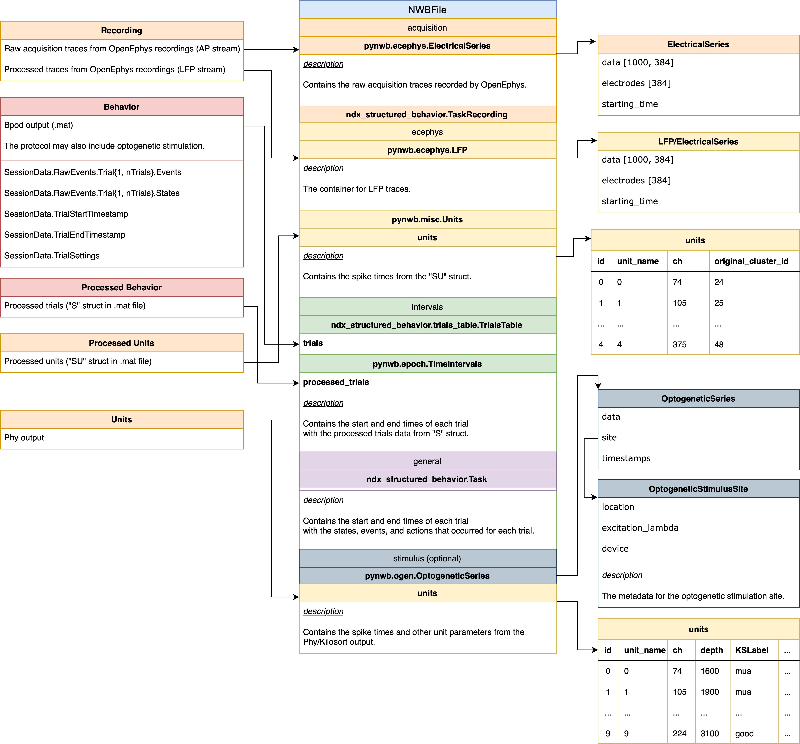

# Notes concerning the schierek_embargo_2024 conversion

## Neuropixels project

In this project, the same behavior task is performed (as in mah_2024 conversion, see [notes](https://github.com/catalystneuro/constantinople-lab-to-nwb/blob/58892fa996e0310c9a3047731484bed3ba0a111d/src/constantinople_lab_to_nwb/mah_2024/mah_2024_notes.md)) while
 Neuropixels records extracellular electrophysiology from ~20 rats.

Synchronization is performed with an Arduino that
sends bar codes to both the B-Pod system and the OpenEphys system.

This experiment type includes:
* Electrophysiology recordings from the OpenEphys acquisition system
* Output from Kilosort for automated spike sorting and Phy for manual curation

### Processed Ephys data

The processed ephys data is stored in custom .mat files (e.g. `J076_2023-12-12.mat`) with the following fields:

The "SU" struct is a cell array of all individual cells simultaneously recorded by neuropixels in this session.

- `SU` (1 x num_units)
  - `cluster_id` – The cluster ID denoted by Phy (matches `original_cluster_id` in the units table)
  - `st` – The times of each spike in seconds
  - `rec_channel` – The channel on the neuropixels probe that the cell was recorded on (1-indexed)
  - `probe_channel` - The channel on the neuropixels probe that the cell was recorded on (1-indexed)
  - `channel_depth` – The distance of the channel from the tip of the neuropixels probe in micrometers
  - `hmat` – struct of task event aligned firing rates. CON: center light on, COFF: center light off, SON: side light on, SOFF: side light off, Rew: reward port poke after reward delivery, Opt: opt out port poked. (ntrials x ntime bins)
  - `xvec` – struct of task event aligned time bins in seconds. (1 x ntime)
  - `location` – denotes whether the cell is located within the LO or elsewhere in the frontal cortex.
  - `umDistFromL1` – distance from L1 in microns
  - `AP` – anterior/posterior neuropixels probe location relative to Bregma
  - `ML` – medial/lateral neuropixels probe location relative to Bregma

#### MATLAB `SU` `location` field converter

The "location" field in some of the processed ephys data files (e.g. `E003_2022-08-01.mat`) when reading in Python shows up as a `MatlabOpaque` object.
To make the location field readable in Python, please use the `schierek_embargo_2024/mat_utils/convertSULocationToString.m` utility script to convert the location field to a string.

This script processes .mat files containing the location field within `SU` structures to ensure compatibility with Python.
The script:
1) Recursively searches through a specified directory for .mat files,
2) Loads each file and processes the 'SU' struct if present (skipping files without 'SU' struct)
3) Converts location fields from MATLAB data types (cell arrays, strings) to character arrays to ensure compatibility with Python
4) Preserves the original 'S' structure while saving the modified data ('SU' and 'S') back to the .mat file

Run this script in MATLAB to process all ephys .mat data files **before** converting to NWB.

```matlab
% MATLAB script to process all .mat files in a specified directory,
% checking for 'SU' structure and converting 'location' to a plain string if it exists

% Specify the path to your directory containing the .mat files
folderPath = '/Volumes/T9/Constantinople/Ephys Data/'; % Replace with your actual folder path

% Get a list of all .mat files in the directory
files = dir(fullfile(folderPath, '**', '*.mat'));
matFiles = fullfile({files.folder}, {files.name});

% Loop through each .mat file in the directory
for k = 1:length(matFiles)
    matFilePath = fullfile(folderPath, matFiles(k));
    matFilePath = char(matFiles{k});  % Ensure it is a character array
    % Load the .mat file
    try
        data = load(matFilePath);
    catch ME
        % Handle the error
        disp(['An error occurred: ', ME.message]);
        continue
    end

    % Check if 'SU' structure exists in the loaded data
    if isfield(data, 'SU')
        SU = data.SU;  % Get the SU structure
        numUnits = length(SU);

        % Iterate over each unit in the SU structure
        for i = 1:numUnits
            if isfield(SU{i}, 'location')
                % Check and convert location if it is a cell array
                if iscell(SU{i}.location) && ~isempty(SU{i}.location)
                    locationStr = SU{i}.location{1}; % Extract first element if it is a cell
                else
                    locationStr = SU{i}.location;
                end
                SU{i}.location = locationStr;
            end
        end

        S = data.S;
        save(matFilePath, 'S', 'SU');
        disp(['Processed and saved: ', matFilePath]);
            % Clear variables to free up workspace
        clear SU;
        clear S;
        clear data;
    end
end
```

### Processed behavior data

The processed behavior data is stored in custom .mat files (e.g. `J076_2023-12-12.mat`) with the following fields:

- `S`
  - `NoseInCenter` – time (s) rat was required to maintain center port to initiate the trial- uniformly drawn from [0.8 - 1.2] s (1 x ntrials). (same as `nose_in_center` in the trials table)
  - `TrainingStage` - vector for the training stage for each trial included. Value of 9 corresponds to stage 8 described in methods (1 x ntrials)
  - `Block` – block on that trial. 1: Mix block, 2: High block, 3: Low block (1 x ntrials).
  - `BlockLengthAd` - number of trials in each high or low blocks. Uniformly 40. (1 x ntrials). Same as adapt_block in A_Structs BlockLengthTest - number of trials in each mixed blocks Uniformly 40. (1 x ntrials). Same as test_block in A_Structs
  - `ProbCatch` - catch probability for that trial (1 x ntrials). Same as prob-catch in the A_Struct
  - `RewardDelay` - delay (s) on that trial to receive reward. Set to 100 for catch trials. Drawn from exponential distribution with mean = 2.5 s (1 x ntrials). Same as reward_delay in the A_struct.
  - `RewardAmount` - reward offered (uL) on that trial. [5 10 20 40 80] for males and some females, [4 8 16 32 64] for some females (1 x ntrials). Same as reward in A_struct.
  - `RewardedSide` – side of the offered reward (1 x ntrials)
  - `Hits` - logical vector for whether the rat received reward on that trial. True = reward was delivered. False = catch trials or violation trials (1 x ntrials). Same as hits in the A_struct.
  - `ReactionTime` - The reaction time in seconds
  - `Vios` - logical vector for whether the rat violated on that trial - did not maintain center poke for time required by nic. (1 x ntrials). Same as vios in the A_struct.
  - `Optout` – logical vector for whether the rat opted out of that trial. May be catch trial or optional opt outs (ntrials x 1). Same as optout in A_Struct
  - `WaitForPoke` - The time (s) between side port poke and center poke.
  - `wait_time` - wait time for the rat on that trial, after removing outliers (set by wait_thresh). For hit trials (reward was delivered), wait_time = reward_delay. For opt-out trials, wait_time = time waited from trial start to opt-ing out (1 x ntrials)
  - `iti` - time to initiate trial (s). Time between the end of the consummatory period and the time to initiate the next trial (1 x ntrials). Same as ITI in A_struct.
  - `Cled` – Time of center light on/off for each trial (2 x ntrials)
  - `Lled` – Time of reft light on/off for each trial (n x ntrials)
  - `l_opt` – Time of left port entered/exited for each trial (n x ntrials)
  - `Rled` – Time of right light on/off for each trial (n x ntrials)
  - `r_opt` – Time of left port entered/exited for each trial (n x ntrials)
  - `recordingLength` – time duration of the entire recording
  - `wait_thresh` – time threshold for wait times of engagement for this session.

#### TimeIntervals

We are adding the processed trials data to the NWB file as [TimeIntervals](https://pynwb.readthedocs.io/en/stable/pynwb.epoch.html).
The `processed_trials` table will be stored in the `intervals` group in the NWB file.

The `schierek_embargo_2024.session_to_nwb()` function uses the `column_name_mapping` and `column_descriptions` dictionaries
to map the processed data to the NWB file. The `column_name_mapping` is used to rename the columns in the processed data
to more descriptive column names. The `column_descriptions` are used to provide a description of each column in the processed data.

```python
# The column name mapping is used to rename the columns in the processed data to more descriptive column names. (optional)
column_name_mapping = dict(
    NoseInCenter="nose_in_center",
    TrainingStage="training_stage",
    Block="block_type",
    BlockLengthAd="num_trials_in_adaptation_blocks",
    BlockLengthTest="num_trials_in_test_blocks",
    ProbCatch="catch_percentage",
    RewardDelay="reward_delay",
    RewardAmount="reward_volume_ul",
    WaitForPoke="wait_for_center_poke",
    hits="is_rewarded",
    vios="is_violation",
    optout="is_opt_out",
    wait_time="wait_time",
    wait_thresh="wait_time_threshold",
    wait_for_cpoke="wait_for_center_poke",
    zwait_for_cpoke="z_scored_wait_for_center_poke",
    RewardedSide="rewarded_port",
    Cled="center_poke_times",
    Lled="left_poke_times",
    Rled="right_poke_times",
    l_opt="left_opt_out_times",
    r_opt="right_opt_out_times",
    ReactionTime="reaction_time",
    slrt="short_latency_reaction_time",
    iti="inter_trial_interval",
)

column_descriptions = dict(
    NoseInCenter="The time in seconds when the animal is required to maintain center port to initiate the trial (uniformly drawn from 0.8 - 1.2 seconds).",
    TrainingStage="The stage of the training.",
    Block="The block type (High, Low or Test). High and Low blocks are high reward (20, 40, or 80μL) or low reward (5, 10, or 20μL) blocks. Test blocks are mixed blocks.",
    BlockLengthAd="The number of trials in each high reward (20, 40, or 80μL) or low reward (5, 10, or 20μL) blocks.",
    BlockLengthTest="The number of trials in each mixed blocks.",
    ProbCatch="The percentage of catch trials.",
    RewardDelay="The delay in seconds to receive reward, drawn from exponential distribution with mean = 2.5 seconds.",
    RewardAmount="The volume of reward in microliters.",
    hits="Whether the subject received reward for each trial.",
    vios="Whether the subject violated the trial by not maintaining center poke for the time required by 'nose_in_center'.",
    optout="Whether the subject opted out for each trial.",
    WaitForPoke="The time (s) between side port poke and center poke.",
    wait_time="The wait time for the subject for for each trial in seconds, after removing outliers."
        " For hit trials (when reward was delivered) the wait time is equal to the reward delay."
        " For opt-out trials, the wait time is equal to the time waited from trial start to opting out.",
    wait_for_cpoke="The time between side port poke and center poke in seconds, includes the time when the subject is consuming the reward.",
    zwait_for_cpoke="The z-scored wait_for_cpoke using all trials.",
    RewardedSide="The rewarded port (Left or Right) for each trial.",
    Cled="The time of center port LED on/off for each trial (2 x ntrials).",
    Lled="The time of left port LED on/off for each trial (2 x ntrials).",
    Rled="The time of right port LED on/off for each trial (2 x ntrials).",
    l_opt="The time of left port entered/exited for each trial (2 x ntrials).",
    r_opt="The time of right port entered/exited for each trial (2 x ntrials).",
    ReactionTime="The reaction time in seconds.",
    slrt="The short-latency reaction time in seconds.",
    iti="The time to initiate trial in seconds (the time between the end of the consummatory period and the time to initiate the next trial).",
    wait_thresh="The threshold in seconds to remove wait-times (mean + 1*std of all cumulative wait-times).",
)
```

### Session start time

The session start time is the reference time for all timestamps in the NWB file. We are using `session_start_time` from the Bpod output. (The start time of the session in the Bpod data can be accessed from the "Info" struct, with "SessionDate" and "SessionStartTime_UTC" fields.)

### Bpod trial start time

We are extracting the trial start times from the Bpod output using the "TrialStartTimestamp" field.

```python
from pymatreader import read_mat

bpod_data = read_mat("raw_Bpod/J076/DataFiles/J076_RWTautowait2_20231212_145250.mat")["SessionData"] # should contain "SessionData" named struct

# The trial start times from the Bpod data
bpod_trial_start_times = bpod_data['TrialStartTimestamp']

bpod_trial_start_times[:7]
>>> [19.988, 39.7154, 43.6313, 46.8732, 59.4011, 77.7451, 79.4653]
```

### NIDAQ trial start time

The aligned trial start times can be accessed from the processed behavior data using the `"Cled"` field.

```python
from pymatreader import read_mat

S_struct_data = read_mat("J076_2023-12-12.mat")["S"] # should contain "S" named struct
# "Cled" field contains the aligned onset and offset times for each trial [2 x ntrials]
center_port_onset_times = [center_port_times[0] for center_port_times in S_struct_data["Cled"]]
center_port_offset_times = [center_port_times[1] for center_port_times in S_struct_data["Cled"]]

center_port_onset_times[:7]
>>> [48.57017236918037, 68.2978722016674, 72.2138230625031, 75.45578122765313, 87.98392024937102, 106.3281781420765, 108.04842315623304]
```

## Alignment

We are aligning the starting time of the recording and sorting interfaces to the Bpod interface.

We are computing the time shift from the Bpod trial start time to the NIDAQ trial start time.

From a conceptual point of view, the trial start and the central port onset are equivalent: a trial starts when the first time the central port is on.


```python
time_shift = bpod_trial_start_times[0] - center_port_onset_times[0]
>>> -28.58217236918037
```

We are applying this time_shift to the timestamps for the raw recording as:

```python
from neuroconv.datainterfaces import OpenEphysRecordingInterface
recording_folder_path = "J076_2023-12-12_14-52-04/Record Node 117"
ap_stream_name = "Record Node 117#Neuropix-PXI-119.ProbeA-AP"
recording_interface = OpenEphysRecordingInterface(recording_folder_path, ap_stream_name)

unaligned_timestamps = recording_interface.get_timestamps()
unaligned_timestamps[:7]
>>> [29.74, 29.74003333, 29.74006667, 29.7401, 29.74013333, 29.74016667, 29.7402]

aligned_timestamps = unaligned_timestamps + time_shift
>>> [1.15782763, 1.15786096, 1.1578943 , 1.15792763, 1.15796096, 1.1579943 , 1.15802763]
```

1) When the time shift is negative and the first aligned timestamp of the recording trace is negative:
- shift back bpod (from every column that has a timestamp they have to be shifted back)
- shift back session start time
- don't have to move recording nor the center_port_onset_times and center_port_offset_times
2) When the time shift is negative and the first aligned timestamp of the recording trace is positive
- we move the recording, center_port_onset_times and center_port_offset_times backward
3) When time shift is positive
- we move the recording, center_port_onset_times and center_port_offset_times forward


### Mapping to NWB

The following UML diagram shows the mapping of source data to NWB.



## OpenEphys XML Channel Fixer

This utility helps fix OpenEphys `settings.xml` files when channels are accidentally dropped by the OpenEphys GUI.
This issue can prevent proper data extraction using our extractors. The script identifies missing AP channels and adds
them back to the XML configuration with the correct electrode positions.


### Usage

```python
from constantinople_to_nwb.utils import fix_settings_xml_missing_channels
import probeinterface
from pathlib import Path

# Path to the settings.xml file
settings_path = Path("/path/to/your/Ephys Data/E003_2022-08-22_14-56-16/Record Node 103/settings.xml")

# Fix the XML file
modified_path = fix_settings_xml_missing_channels(
    settings_xml_file_path=settings_path,
    # Optional: specify AP stream name to verify the file can be read with probeinterface
    stream_name="Record Node 103#Neuropix-PXI-100.0"
)

# Verify the channel configuration has been updated successfully
ap_stream_name = "Record Node 103#Neuropix-PXI-100.0"  # The name of the AP recording stream
probe = probeinterface.read_openephys(
  settings_file=settings_path, stream_name=ap_stream_name
)
assert len(probe.contact_ids) == 384
```
